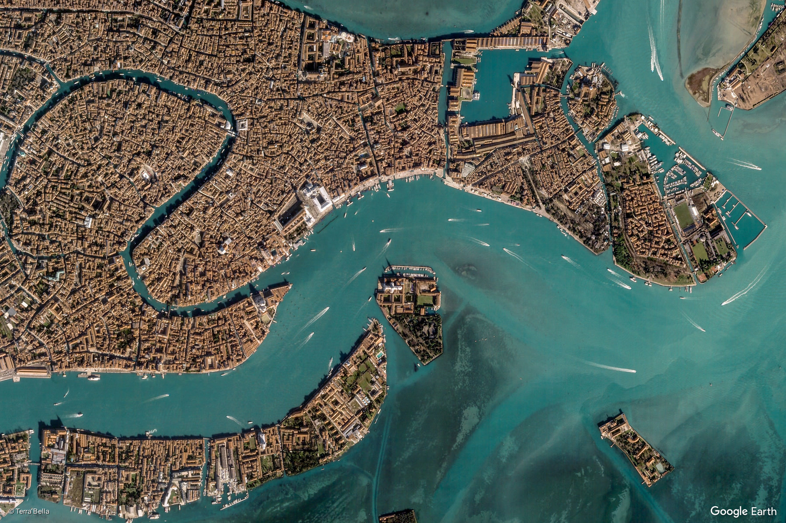
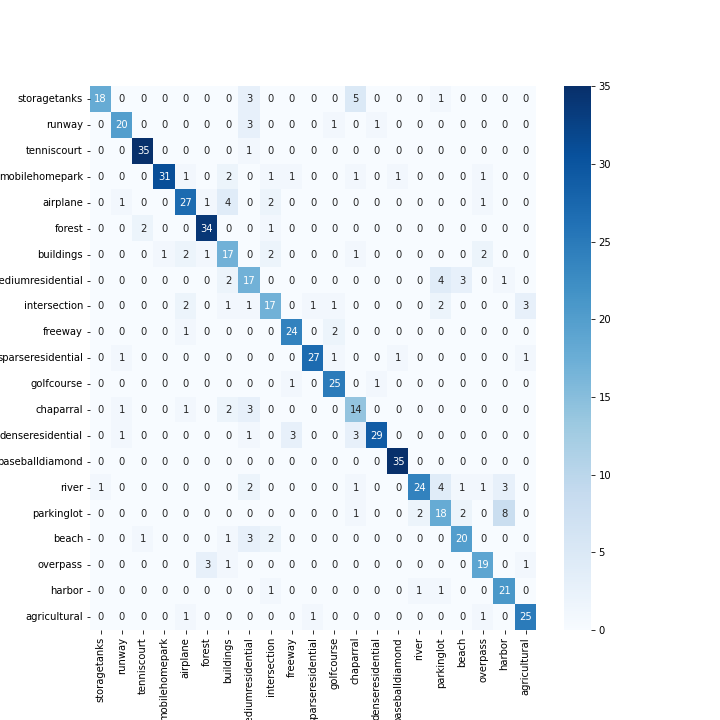
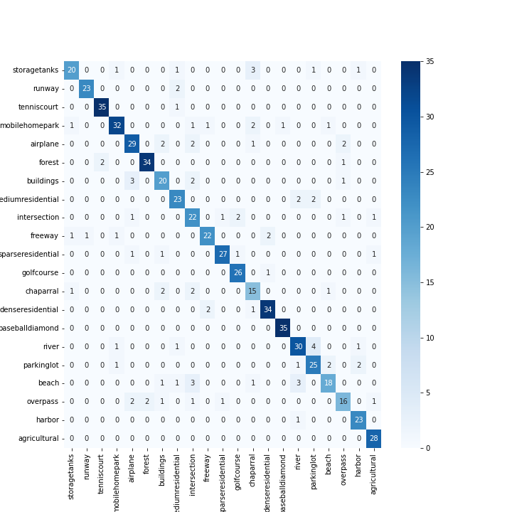
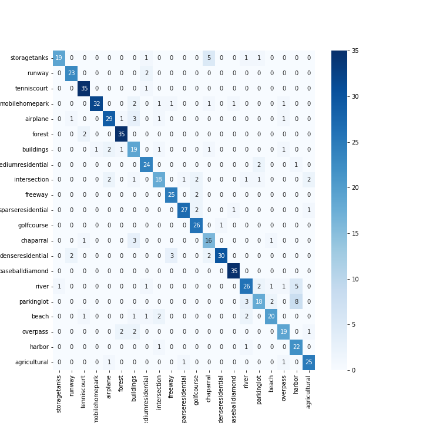

<div align="center">



<sub>Image source: [Earth View by Google Maps](https://earthview.withgoogle.com/)</sub>

# Satellite Image Classification Using HOG and DAISY Feature Descriptors

[](https://ieeexplore.ieee.org/abstract/document/9988636)
[](https://www.wits.ac.za/)
[](https://www.python.org/)
[](http://weegee.vision.ucmermerced.edu/datasets/landuse.html)

**Themba Ngobeni** | School of Computer Science and Applied Mathematics | University of the Witwatersrand, Johannesburg

Published on IEEE Xplore: [View Paper](https://ieeexplore.ieee.org/abstract/document/9988636) | Research Summary: [View PDF](RESEARCH_SUMMARY.pdf)

</div>

---

## Overview

This repository contains the implementation and results from an Honours research project focused on automating satellite image classification using classical computer vision techniques.

The volume of high-resolution satellite imagery collected globally has grown exponentially due to cheaper and more powerful satellite hardware. Manual classification at this scale is both inaccurate and unsustainable. This research investigates efficient, reliable autonomous classification using the **Bag of Features (BOF)** method on the UC Merced Land Use dataset.

The primary goal was to build on the approach proposed by [Wilson and Arif (2017)](https://arxiv.org/abs/1702.06850) and improve classification accuracy for satellite object recognition using the DAISY feature descriptor combined with an SVM classifier.

---

## Research Methodology

The classification pipeline follows four stages:

```
Raw Image -> Feature Extraction -> Encoding -> Pooling -> Classification
               (DAISY)          (Mini-Batch    (L2)       (SVM)
                                  K-Means)
```

**Feature Extraction:** DAISY dense descriptors were used in place of HOG to capture local image structure more effectively across the 21 scene categories in the dataset.

**Encoding:** Bag of Features encoding via Mini-Batch K-Means clustering.

**Pooling:** L2 pooling to produce fixed-length feature vectors regardless of image size.

**Classification:** A 10-fold cross-validation experiment was run using Support Vector Machine classifiers with multiple kernel configurations.

HOG was also evaluated as a standalone feature extractor and proved unviable for this task, achieving only 36.73% accuracy.

---

## Results

The **Hybrid SVM classifier with an RBF kernel** was the best performing model, outperforming all other classifiers tested.

| Classifier        | Accuracy |
|-------------------|----------|
| Hybrid (SVM + RBF)| 81.42%   |
| Linear Classifier | 76.19%   |
| DAISY only        | 73.40%   |
| KNN               | 68.02%   |
| HOG only          | 36.73%   |

**Comparison against prior work on the UC Merced dataset:**

| Method               | Year | Accuracy |
|----------------------|------|----------|
| BOVW + SCK           | 2010 | 77.71%   |
| Dirichlet            | 2013 | 92.80%   |
| VLAD                 | 2014 | 94.30%   |
| DCNN + SIFT BOVW     | 2018 | 95.00%   |
| Inception-v3-CapsNet | 2020 | 80.00%   |
| This work (SVM + RBF)| 2022 | 81.42%   |

The results are competitive with other non-deep-learning methods and outperform the Inception-v3-CapsNet approach, which is notable given the limited dataset size (21 classes) that makes deep learning approaches less suitable.

---

## Confusion Matrices

**DAISY Classifier**



**Hybrid Classifier (Best Model)**



**Linear Classifier**



---

## Key Findings

- HOG alone is not a viable feature extractor for satellite image classification at this scale, scoring only 36.73%.
- The DAISY descriptor combined with Bag of Features encoding and an SVM with an RBF kernel produces the most accurate results.
- The UC Merced dataset, while widely used, is constrained to 21 scene classes. This limits how well models generalise to the full diversity of real-world satellite imagery.
- CNN-based approaches were intentionally excluded due to the limited dataset size. Data-hungry models underperform on small datasets compared to well-tuned classical approaches.

---

## Limitations and Future Work

The UC Merced Land Use dataset is one of the most widely used benchmarks in this domain but contains only 21 scene categories, which is a small number relative to the variety of classes encountered in real-world remote sensing applications.

Planned future directions include:

- Applying convolutional neural networks on a larger dataset with significantly more scene classes
- Exploring transfer learning to overcome the data size constraint
- Evaluating performance on more recent high-resolution satellite datasets

---

## References

[1] Engin Tola, Vincent Lepetit, and Pascal Fua. "Daisy: An efficient dense descriptor applied to wide-baseline stereo". IEEE Transactions on Pattern Analysis and Machine Intelligence, 32.5 (2009), pp. 815-830.

[2] Jobin Wilson and Muhammad Arif. "Scene recognition by combining local and global image descriptors". arXiv preprint arXiv:1702.06850 (2017). [Link](https://arxiv.org/abs/1702.06850)

---

<div align="center">

**Themba Ngobeni** | University of the Witwatersrand | School of Computer Science and Applied Mathematics

[](https://ieeexplore.ieee.org/abstract/document/9988636)

</div>
